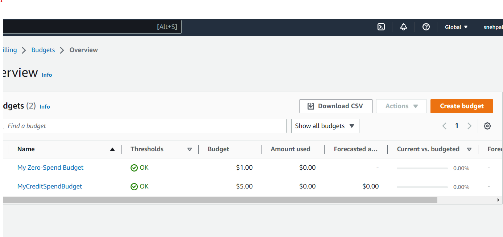

# Week 0 — Billing and Architecture

## 1.Create a Billing Alarm

## 2.Create a Budget

I created two budgets- one is MyZero-SpendBudget of $1 to avoid cost using services and other one is MyCreditSpendBudget of $5 to keep track of my credits.

## 3.Install a AWS CLI

## 4.Cruddur_Conceptual Architecture Design

I created Conceptual Architecture Design using Lucid Charts. Following is the link to Lucid Chart Design-

[Cruddur/Conceptual Diagram](https://lucid.app/lucidchart/74ae796f-8427-41f9-b995-1c86bbdf274b/edit?viewport_loc=-451%2C-398%2C2716%2C1276%2C0_0&invitationId=inv_819b040f-b471-45c9-bf66-16023dd4e532)

[Image of Conceptual Diagram](assets/week0_conceptualDesign.png)

## 5.Cruddur_Logical Architecture Design

I created Logical Architecture Design using Lucid Charts. Follwoing is the link to Lucid Chart Diagram

[Cruddur/Logical Diagram](https://lucid.app/lucidchart/74ae796f-8427-41f9-b995-1c86bbdf274b/edit?viewport_loc=-451%2C-398%2C2716%2C1276%2C0_0&invitationId=inv_819b040f-b471-45c9-bf66-16023dd4e532)

