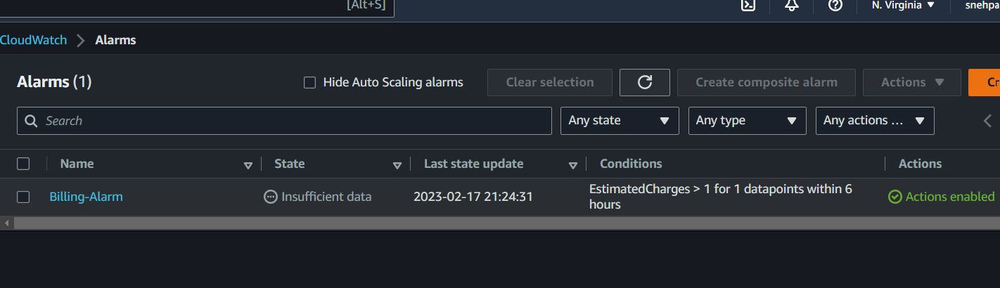
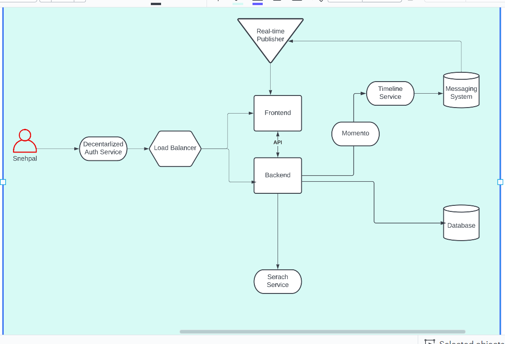
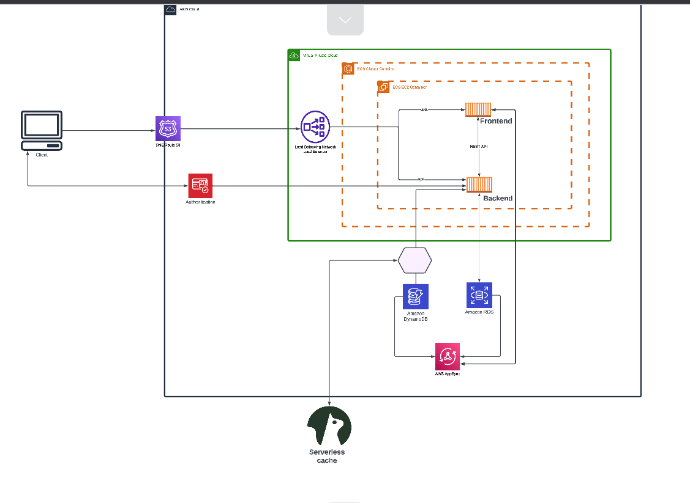

# Week 0 — Billing and Architecture

In the first week of boot camp, I was able to successfully complete a range of tasks: 
- Using the GUI and Command Line Interface, I was able to set up budgets, SNS, and alarms. 
- Installed AWS CLI in Gitpod 
- Learned about Architecture frameworks and created conceptual, logical designs using Lucid Chart.
- To enhance the security of my account, I set up MFA on both my root user and IAM user account. Also, I was able to successfully generate Access Key for my IAM user account.

## 1.Create a Billing Alarm

Created a billing alarm using GUI.




## 2.Create a Budget

I created two budgets- one is MyZero-SpendBudget of $1 to avoid cost using services and other one is MyCreditSpendBudget of $5 to keep track of my credits.


## 3.Install AWS CLI in GitPod

To install AWS CLI, I followed step by step guide using [AWS CLI documentation for Linux](https://docs.aws.amazon.com/cli/latest/userguide/getting-started-install.html). To install AWS CLI, I issued the following commands in my GitPod terminal:

```
curl "https://awscli.amazonaws.com/awscli-exe-linux-x86_64.zip" -o "awscliv2.zip"
unzip awscliv2.zip
sudo ./aws/install

```
In first command, I downloaded file using `` curl `` command and saved it on local machine by using **-o** parameter. After downloading, *unzip* was used to unzip the file. Fianlly, I executed bash script ``` install ``` to complete the installation.

To verify the installation, I issued ``` aws account get-contact-information ``` command in terminal.


## 4.Cruddur_Conceptual Architecture Design

I created Conceptual Architecture Design using Lucid Charts. Following is the link to Lucid Chart Design-

[Cruddur/Conceptual Diagram](https://lucid.app/lucidchart/74ae796f-8427-41f9-b995-1c86bbdf274b/edit?viewport_loc=-451%2C-398%2C2716%2C1276%2C0_0&invitationId=inv_819b040f-b471-45c9-bf66-16023dd4e532)




## 5.Cruddur_Logical Architecture Design

I created Logical Architecture Design using Lucid Charts. Follwoing is the link to Lucid Chart Diagram

[Cruddur/Logical Diagram](https://lucid.app/lucidchart/cca7a133-4faf-41cd-8df5-4e932ac7302d/edit?viewport_loc=-2381%2C-105%2C4924%2C2046%2C0_0&invitationId=inv_770182d9-a8ed-4ee9-a603-74756f0c9d7e)



## *References:*
 - [AWS Command Line](https://aws.amazon.com/cli/)
 - [AWS Free Cloud Project Bootcamp](https://www.youtube.com/watch?v=8b8SvQHc4Pk&list=PLBfufR7vyJJ7k25byhRXJldB5AiwgNnWv)


