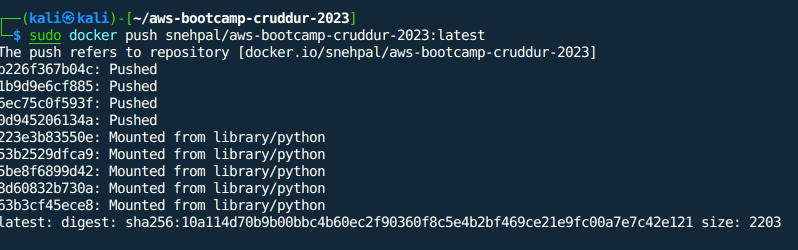
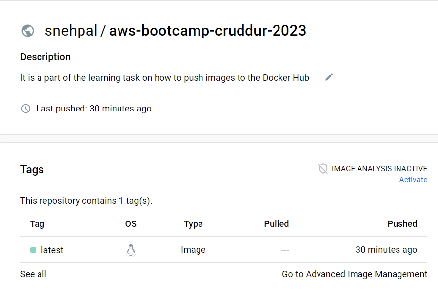

# Week 1 — App Containerization

### Push and tag a image to DockerHub 

To push and tag a image to Docker Hub, you need to first register an account on Docker Hub. After that, create a repository in DockerHub. Afterwards, build an image on your local machine from DockerFile that you would like to push to the repository you created on Docker Hub. 

In order to push your image to Docker Hub, you need to login on Docker client using the following command: ``docker login --username=yourUsername``

To tag an image, use this command: ``docker tag imageid username/repositoryname:latest``

To push an image to DockerHub, use `` docker push username/repositoryname :latest``

Finally, you should see an image in your Repository:

