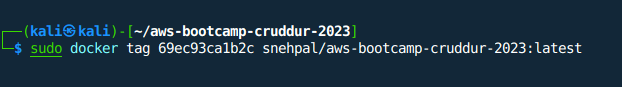

# Week 1 — App Containerization

> :memo: *During this week, I gained knowledge about the significance of app containerization and its benefits. I created separate Dockerfiles for backend-flask and frontend-react, and orchestrated the containers using a docker-compose.yml file. Additionally, I familiarized myself with Docker's best practices, such as multi-staging and implementing health checks in Dockerfiles and learned the process of pushing images to DockerHub.*

## Create a Docker file for backend-flask

Following is the Dockerfile that is used to build a Docker image for a backend-flask.

🔗 [Link for Code Commit](https://github.com/snehpalkaur/aws-bootcamp-cruddur-2023/commit/4ab86b9fa9445857585d4ea5d74065ee4ba2c324)

```dockerfile
#Sets the base image for the Docker container.The base image is the official Python 3.10 slim version running on Debian Buster.
FROM python:3.10-slim-buster

#Sets the working directory inside the container to /backend-flask.
WORKDIR /backend-flask

# Copies the requirements.txt file from the local machine to the container's working directory.
COPY requirements.txt requirements.txt

# Installs the dependencies listed in requirements.txt file inside the container using pip3
RUN pip3 install -r requirements.txt

#Copies all the files and folders from the current directory of the local machine to the container's working directory.
COPY . .

#Sets an environment variable named FLASK_ENV with the value development.
ENV FLASK_ENV=development

#exposes the container's port ${PORT} to the outside world
EXPOSE ${PORT}

#Specifies the command to be run when the container starts. It starts the backend-flask by running the flask run
#command with the options --host=0.0.0.0 and --port=4567, which specifies that the application should 
#listen on all network interfaces (0.0.0.0) and the port ${PORT} (default is 4567).
CMD [ "python3", "-m" , "flask", "run", "--host=0.0.0.0", "--port=4567"]

```


## Create a Docker file for frontend_react

🔗 [Link for Code Commit](https://github.com/snehpalkaur/aws-bootcamp-cruddur-2023/commit/4ab86b9fa9445857585d4ea5d74065ee4ba2c324)

```dockerfile
FROM node:16.18

ENV PORT=3000

COPY . /frontend-react-js
WORKDIR /frontend-react-js
RUN npm install
EXPOSE ${PORT}
CMD ["npm", "start"]
```

## Create a Docker Compose file to orchestrate multiple containers

🔗 [Link for Code Commit](https://github.com/snehpalkaur/aws-bootcamp-cruddur-2023/commit/4ab86b9fa9445857585d4ea5d74065ee4ba2c324)

```yml
version: "3.8"
services:
  
  backend-flask:
    environment:
      FRONTEND_URL: "https://3000-${GITPOD_WORKSPACE_ID}.${GITPOD_WORKSPACE_CLUSTER_HOST}"
      BACKEND_URL: "https://4567-${GITPOD_WORKSPACE_ID}.${GITPOD_WORKSPACE_CLUSTER_HOST}"
    build: ./backend-flask
    ports:
      - "4567:4567"
    volumes:
      - ./backend-flask:/backend-flask
  
  frontend-react-js:
    environment:
      REACT_APP_BACKEND_URL: "https://4567-${GITPOD_WORKSPACE_ID}.${GITPOD_WORKSPACE_CLUSTER_HOST}"
    build: ./frontend-react-js
    ports:
      - "3000:3000"
    volumes:
      - ./frontend-react-js:/frontend-react-js
  
  dynamodb-local:
    # https://stackoverflow.com/questions/67533058/persist-local-dynamodb-data-in-volumes-lack-permission-unable-to-open-databa
    # We needed to add user:root to get this working.
    user: root
    command: "-jar DynamoDBLocal.jar -sharedDb -dbPath ./data"
    image: "amazon/dynamodb-local:latest"
    container_name: dynamodb-local
    ports:
      - "8000:8000"
    volumes:
      - "./docker/dynamodb:/home/dynamodblocal/data"
    working_dir: /home/dynamodblocal
  
  db:
    image: postgres:13-alpine
    restart: always
    environment:
      - POSTGRES_USER=postgres
      - POSTGRES_PASSWORD=password
    ports:
      - '5432:5432'
    volumes: 
      - db:/var/lib/postgresql/data
  
networks: 
  internal-network:
    driver: bridge
    name: cruddur
volumes:
  db:
    driver: local
```

## Create a notification feature for Cruddur

I was also able to successfully implement the notifications page in Cruddur. 

👉 Here is the link for the commits: [Implementation of Notifications Page](https://github.com/snehpalkaur/aws-bootcamp-cruddur-2023/commit/1e2bac37abb94526c38f19df6618c3174737dfa7)

## Implement DynamoDB and PostgreSQL

Successfully configured dynamoDB and PostgreSQL

👉 Here is the link for the commits: [Configuration of DynamoDB and PostgreSQL](https://github.com/snehpalkaur/aws-bootcamp-cruddur-2023/commit/bb3bbfdd22128cb0af05b244adf82ba09f001362)


## Push and tag a image to DockerHub 

> To push and tag a image to Docker Hub, you need to first register an account on Docker Hub. After that, create a repository in DockerHub. Afterwards, build an image on your local machine from DockerFile that you would like to push to the repository you created on Docker Hub. 

In order to push your image to Docker Hub, you need to login on Docker client using the following command: ``docker login --username=yourUsername``


To tag an image, use this command: ``docker tag imageid username/repositoryname:latest``



To push an image to DockerHub, use `` docker push username/repositoryname :latest``


Finally, you should see an image in your Repository:


